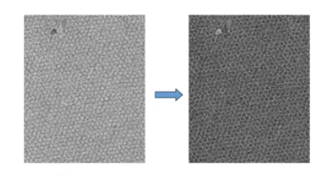

```python
import numpy as np
import matplotlib as mpl

```

$$E=mc^2$$
 inline $E=mc^2$ eqn
 
 inline \(eqn\)
 
 \[E=mc^2\]

---


|head |d|t| 
|:---:|:---:|:---:|
|some | dummy| table|
|some | dummy| table|


---
# L01 
## Image as Functions

---
# Guess the operation


---

# Guess the operation


---

# Guess the operation


---

# Guess the operation



---
# Testing

$$E=mc^2$$
 inline $E=mc^2$ eqn
 
 inline \(eqn\)
 
 \[E=mc^2\]

---

```python
import os

a=1
print(a)
```

```c
#include<stdio.h>

void main(){
     
    int a = 10;
    printf("%d",&a);
}
```


