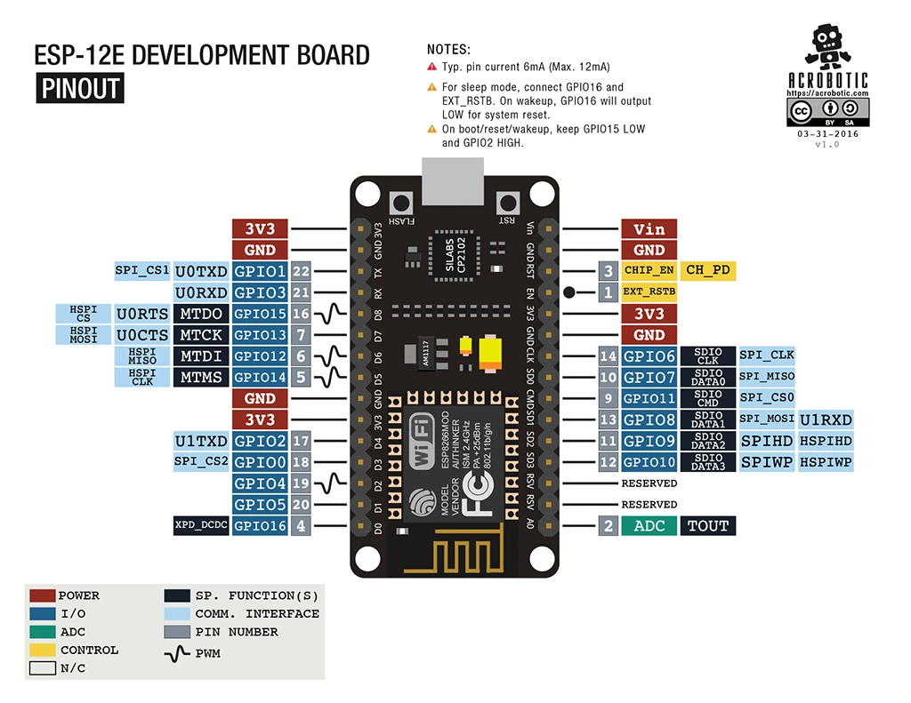
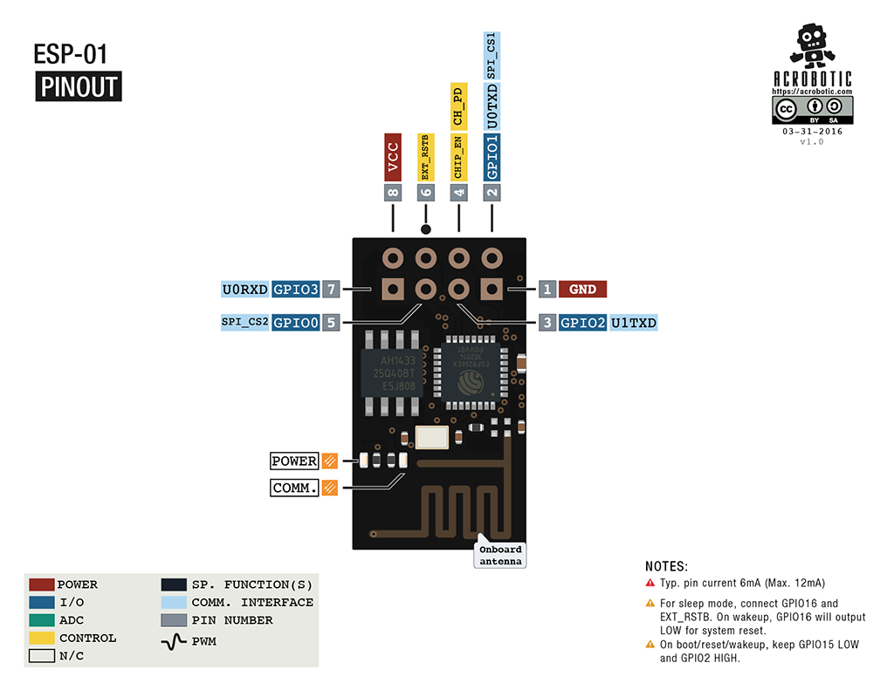

# Web Server 

## What's a web server and HTTP ?

Web server is a program which processes the network requests of the users and serves them with files that create web pages. This exchange takes place using Hypertext Transfer Protocol (HTTP).

1. Web servers are computers used to store HTTP files which makes a website and when a client requests a certain website, it delivers the requested website to the client. 
1. Any computer that can implement http or https is able to play the role of a web server. 
1. The web server can be any software or hardware but is usually a software running on a computer.
1. It must be always connected to the internet, otherwise, it cannot receive and process requests.

[](https://media.geeksforgeeks.org/wp-content/uploads/20190927155217/webserver.png)


## Web Server Definition

It consists of the hardware and software that is responsible for responding to requests on the World Wide Web, with the use of hypertext transfer protocol (HTTP) and other protocols. *These requests are made by clients.*


> The main thing that it is responsible for, is displaying the contents of a website to each user who requests it. This process involves storing, processing, and delivering data.


The exchange of data among devices is facilitated by a web server’s hardware. The software component of a web server controls the users’ access to the hosted files. All systems that host websites need to have the web server software.


---

## HTTP: Hyper Text Transport Protocol

Http is a protocol, a way of communication which supplies web pages. 

* It is pretty widely used and easy to implement. 

* Through http you can transfer html and create simple user interfaces 
* It can implement JavaScript and make more complicated web pages 
* It is available in most of the browsers. 


> One of the great qualities of this protocol is that it replaced complicated and heavy displays, with user friendly web pages.


---
# Functions of a Web Server


1. Web servers store and configure all website data. This is done to protect data from unauthorized users.
1. Web servers have the prime responsibility to enable accessibility to hosted websites. This includes the availability of back-end database server services and more.
1. When potential clients around the globe are trying to access your website, your website’s web server would serve them accordingly. Such potential clients and visitors are known as end users and their access requests are known as end-user requests.
1. Web servers help in controlling the bandwidth; they are equipped to minimize excess network traffic, thus regulating the overall traffic in the network. *This feature of web servers prevents downtime to a great extent. Downtime is usually caused by surplus web traffic.*
1. The presence of a web server enables the creation of dynamic web pages in popular scripting languages such as Perl, Ruby, Python, and others.


---

# How does it work? 

A web browser uses HTTP to request a file hosted on a web server. The HTTP server accepts this request, finds the file, and then sends it back to the browser using HTTP.  

###  Steps involved in the process:
* A user specifies the URL they want to access in the address bar.
* The browser fetches the IP address of the domain name. This would take the web browser to the web server.
* The browser requests the file from the web server using HTTP.
* The web server will send back the requested file via HTTP. If, in case, the file does not exist, an error message will be sent.
* The browser displays the web page.

> The request will consist of information about the kind of browser that is used, about the computer or about the document requested. 

It will have a **method**, a **URL**, a **query string** and the **upload body** in case you want data to be sent to the server.

### Response Status

* The **response will** include the status, which tells the browser if the page was found or not.

> 400s are about a not found page, 
> 300 are redirections and 
> 200s are confirmations of the page being found. 


[](https://ocw.cs.pub.ro/courses/_media/iot2015/courses/picture1.png?cache=&w=827&h=306&tok=dcc09f)

---

# HTTPS: Hyper Text Transport Protocol Secure
## Https has two important security roles.

1. **It encripts the data.** The request and the response will be both encripted on sending and decripted when read.
1. The server is always asked for a certificate of authenticity before it is asked for a page. This prevents against stolen data through false web pages.
    
---

## What does a query consist of? 

It will always look like this: 
```html

http://address:port/URL?querystring

```


The port can be absent, in which case it will be 80 for http and 443 for https. 

It has to be specified if it is not one the two. 

Concerning the URL, when it is not written, the default will be `/`.

> The available methods in http are : get, post, put and delete. The main ones being the first two.


---


### GET

* Get method needs no upload body. It will only ask for data from the server and send only the headers, the address, the URL.
    

### POST

* Post sends important data to the server, which will be uploaded. Post has the role of modifying data on the server. The response of both these methods is the page and any additional information that was requested.
    

### PUT

* Put is similar to post, only that in the semantic way, this method only creates an object on the server.
    

### DELETE

* Delete also plays a semantic part. It needs no upload body and it delets objects on the server. The same action can be performed however using get.
    
---


> On one server there can be more than one websites, which means that, if the host is not specified in the request, the response may not be the one the browser expects.

Also, the response may have more than text. Any additional feature: images, JavaScript objects and so on will need a new request, so the process will be slowed down.


---

# Example Code for ESP AP (server) and Stattion (client) mode
[Github Repo](https://github.com/prateekrajgautam/Hardware_Code/tree/main/WIFI_RSSI_ESP8266_AP_and_STA)

### Pin Config




---
[AP Mode ](https://github.com/prateekrajgautam/Hardware_Code/blob/main/WIFI_RSSI_ESP8266_AP_and_STA/src/AP_ESP01_BS_Tx.cpp_)

[STA Mode](https://github.com/prateekrajgautam/Hardware_Code/blob/main/WIFI_RSSI_ESP8266_AP_and_STA/src/STA_ESP8266_NODE_RX_readRssi.cpp)

[platformio.ini](https://github.com/prateekrajgautam/Hardware_Code/blob/main/WIFI_RSSI_ESP8266_AP_and_STA/platformio.ini)

---

### platformio.ini

```ini

; PlatformIO Project Configuration File
;
;   Build options: build flags, source filter
;   Upload options: custom upload port, speed and extra flags
;   Library options: dependencies, extra library storages
;   Advanced options: extra scripting
;
; Please visit documentation for the other options and examples
; https://docs.platformio.org/page/projectconf.html


[env:nodemcu]
platform = espressif8266
board = nodemcu
framework = arduino
monitor_speed = 115200

[env:esp01]
platform = espressif8266
framework = arduino
board = esp01
monitor_speed = 115200
;upload_protocol = serial
;board_build.mcu = esp8266
;upload_protocol = esptool
```


---
### AP Mode 

```c

#include <Arduino.h>
#include <ESP8266WiFi.h> // Include the Wi-Fi library
//#include <ESP8266WiFiMulti.h>   // Include the Wi-Fi-Multi library

//SSID of your network

//const char *ssid = "ESP-01_BS";
const char *ssid = "ESP-8266_BS";
const char *password = "password";

void setup()
{
  Serial.begin(115200);
  delay(10);
  Serial.println('\n');

  WiFi.softAP(ssid, password); // Start the access point
  Serial.print("Access Point \"");
  Serial.print(ssid);
  Serial.println("\" started");

  Serial.print("IP address:\t");
  Serial.println(WiFi.softAPIP()); // Send the IP address of the ESP8266 to the computer
}

void loop() {}

```
---

### STA Mode


```c

#include <Arduino.h>
#include <ESP8266WiFi.h>      // Include the Wi-Fi library
#include <ESP8266WiFiMulti.h> // Include the Wi-Fi-Multi library

//#include <SPI.h>
//#include <WiFi.h>


//LED pin

#define LED 2 
float max_rssi = -1000;
float min_rssi = -0;
//SSID of your network

const char *ssid = "ESP-01_BS";
const char *password = "password";

const char *ssid2 = "ESP-8266_BS";
const char *password2 = "password";

ESP8266WiFiMulti wifiMulti; // Create an instance of the ESP8266WiFiMulti class, called 'wifiMulti'

void setup()
{
  pinMode(LED, OUTPUT);
  Serial.begin(115200); // Start the Serial communication to send messages to the computer
  delay(10);
  Serial.println('\n');

  wifiMulti.addAP(ssid, password);
  //wifiMulti.addAP(ssid1, password1);
  wifiMulti.addAP(ssid2, password2); // add Wi-Fi networks you want to connect to
  //wifiMulti.addAP(ssid3, password3);   // add Wi-Fi networks you want to connect to

  Serial.println("Connecting ...");
  //int i = 0;
  while (wifiMulti.run() != WL_CONNECTED)
  { // Wait for the Wi-Fi to connect: scan for Wi-Fi networks, and connect to the strongest of the networks above
    Serial.print("Connecting");
    delay(1000);
    Serial.print('.');
  }
  Serial.println('\n');
  Serial.print("Connected to ");
  Serial.println(WiFi.SSID()); // Tell us what network we're connected to
  Serial.print("IP address:\t");
  Serial.println(WiFi.localIP()); // Send the IP address of the ESP8266 to the computer
  
}

void loop()
{
  if (wifiMulti.run() != WL_CONNECTED)
  {

    Serial.print("\nDisconnected\n\n");
    while (wifiMulti.run() != WL_CONNECTED)
    { // Wait for the Wi-Fi to connect: scan for Wi-Fi networks, and connect to the strongest of the networks above
      Serial.print("\nRonnecting");
      delay(1000);
      Serial.print('.');
    }
  }
  Serial.print("\n");
  Serial.print(WiFi.SSID());
  Serial.print(" @ RSSI: ");
  float rssi = WiFi.RSSI();
  Serial.print(rssi);
  if(rssi>max_rssi){
    max_rssi=rssi;
  }
  if(rssi<min_rssi){
    min_rssi=rssi;
  }
  Serial.print("  Max: ");
  Serial.print(max_rssi);
  Serial.print("  min: ");
  Serial.println(min_rssi);
  if(max_rssi-rssi<=10 ){
    digitalWrite(LED, LOW); // Turn the LED on (Note that LOW is the voltage level)
    delay(50); // Wait for a second
    digitalWrite(LED, HIGH); // Turn the LED off by making the voltage HIGH
    //delay(500); // Wait for two seconds
  }
  digitalWrite(LED, HIGH);
}

```


---

### Hints

# Program ESP-01 using arduino nano

## connections


**NANO RST --- NANO GND** *to bypass nano and act as usb to serial*

| NANO | ESP-01 |
| ---- | ------ |
| 3.3V | VCC    |
| GND  | GND    |
| TX   | TX     |
| RX   | RX     |
| GND  | GPIO0  |
| 3.3V | CH_PD  |
|      |        |

- before uploading programme disconnect connection from GPIO0 and and do same with CH_PD
- Wait for the code to be uploaded to ESP8266.
- When you see. ' leaving..  hard resting via RST pin', disconnect the serial port (GPIO 0).
   then connect the RESET (EXT_RSTB) of ESP8266 to ground for 1 second and then release it.

### After programming 

| ESP-01        | Connection |
| ------------- | ---------- |
| VCC           | 3.3V       |
| GND           | GND        |
| CH_PD (CH_EN) | 3.3V       |
|               |            |
|               |            |
|               |            |
---


# Resources 

### webserver on IOT modules like ESP8266

1. [https://github.com/esp8266/ESPWebServer](https://github.com/esp8266/ESPWebServer)

1. [https://www.instructables.com/How-to-Use-ESP8266-As-Webserver/](https://www.instructables.com/How-to-Use-ESP8266-As-Webserver/)


## LAB Experiment

### Step 1

[ESP8266WiFiSTA](https://github.com/esp8266/Arduino/blob/master/libraries/ESP8266WiFi/src/ESP8266WiFiSTA.cpp)


[ESP8266 Based Webserver to Control LED from Webpage](https://iotdesignpro.com/projects/esp8266-based-webserver-to-control-led-from-webpage)