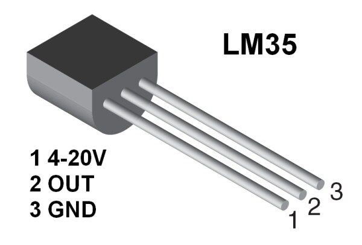
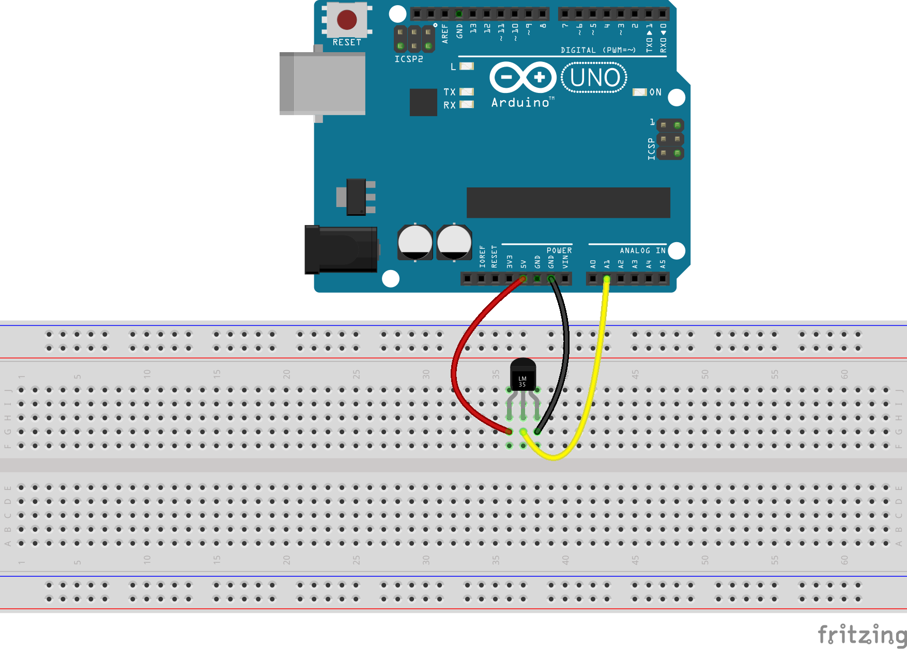

# Temperature Sensor With Arduino UNO


Learn how to read Temperature using LM35 Temperature sensor!

The LM35 series are precision integrated-circuit temperature devices with an output voltage linearly proportional to the Centigrade temperature. The LM35 device has an advantage over linear temperature sensors calibrated in Kelvin, as the user is not required to subtract a large constant voltage from the output to obtain convenient Centigrade scaling.

You can used this sensor for many projects, like fire prevention monitoring, weather forecasting, overheat monitor and many more.

---

## Step 1: Build Circuit

To build our circuit with Arduino Uno, follow the steps below:

1.  Connect Arduino Uno GND to LM35 GND
2.  Connect Arduino 5V pin to LM35 pin 1
3.  Connect Arduino Uno Analog Pin 1 to LM35 pin OUT

## Step 2: Program and Read the Sensor

Download and open the attached source code on Arduino IDE.

---

### LM35 Pin Config



### Connection


Upload the sketch and read the sensor output on Serial Monitor

# Program

```cpp
int pinTemp = A1;   //This is where our Output data goes
void setup() {
  Serial.begin(9600);
}
void loop() {
  int temp = analogRead(pinTemp);    //Read the analog pin
  temp = temp * 0.48828125;   // convert output (mv) to readable celcius
  Serial.print("Temperature: ");
  Serial.print(temp);
  Serial.println("C");  //print the temperature status
  delay(1000);
}
```

## output

Once uploaded you will see the temperature status like this

```bash
Temperature: 29C
Temperature: 28C
Temperature: 29C
Temperature: 27.8C
```
