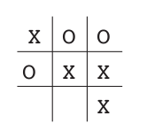
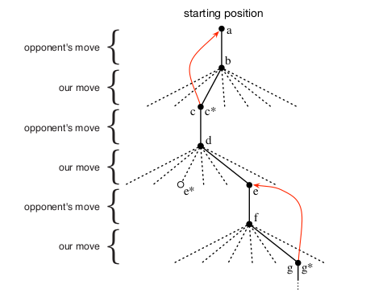

# An Extended Example Tic-Tac-Toe  

- Two players take turns playing on a three-by-three board. 
- One player plays Xs and the other Os until one player wins by placing three marks in a row, horizontally, vertically, or diagonally, as the X player has in the game shown.
- If the board fills up with neither player getting three in a row, then the game is a draw.

> Because a skilled player can play so as never to lose, let us assume that we are playing against an imperfect player, one whose play is sometimes incorrect and allows us to win. let us consider draws and losses to be equally bad for us.

#### How might we construct a player that will find the imperfections in its opponent’s play and learn to maximize its chances of winning?

---

# Although this is a simple problem
### It cannot readily be solved in a satisfactory way through classical techniques.

#### Classical minimax
The classical "minimax" solution from game theory is not correct here because it assumes a particular way of playing by the opponent. 
> ie., a minimax player would never reach a game state from which it could lose, even if in fact it always won from that state because of incorrect play by the opponent.

#### Classical optimization (like dynamic programming)
Classical optimization methods for sequential decision problems, such as dynamic programming, can compute an optimal solution for any opponent
> but require as input a complete specification of that opponent, including the probabilities with which the opponent makes each move in each board state.

---
# What can we do

Let us assume that this (specification of that opponent) infformation is not available a priori for this problem, as it is not for the vast majority of problems of practical interest.

- However, such information can be estimated from experience, in this case by playing many games against the opponent. 

- About the best one can do on this problem is first to learn a model of the opponent’s behavior, up to some level of confidence, and then apply dynamic programming to compute an optimal solution given the approximate opponent model.

---
# Other options
An evolutionary method applied to this problem would directly search the space of possible policies for one with a high probability of winning against the opponent. 

Here, a policy is a rule that tells the player what move to make for every state of the game—every possible configuration of Xs and Os on the three-by-three board. 

For each policy considered, an estimate of its winning probability would be obtained by playing some number of games against the opponent. 

This evaluation would then direct which policy or policies were considered next. 

A typical evolutionary method would hill-climb in policy space, successively generating and evaluating policies in an attempt to obtain incremental improvements.

Or, perhaps, a genetic-style algorithm could be used that would maintain and evaluate a population of policies. 
###### Literally hundreds of dierent optimization methods could be applied. 
---
# Using a value function
Here is how the tic-tac-toe problem would be approached with a method making use of a value function. 
- First we would set up a table of numbers, one for each possible state of the game. Each number will be the latest estimate of the probability of our winning from that state. 
- We treat this estimate as the state’s value, and the whole table is the learned value function. State A has higher value than state B, or is considered "better" than state B, if the current estimate of the probability of our winning from A is higher than it is from B. 
- Assuming we always play Xs, then for all states with three Xs in a row the probability of winning is 1, because we have already won. 
- Similarly, for all states with three Os in a row, or that are filled up, the correct probability is 0, as we cannot win from them. 
- We set the initial values of all the other states to 0.5, representing a guess that we have a 50% chance of winning. 

We then play many games against the opponent. To select our moves we examine the states that would result from each of our possible moves (one for each blank space on the board) and look up their current values in the table. 

> Most of the time we move greedily, selecting the move that leads to the state with greatest value, that is, with the highest estimated probability of winning. Occasionally, however, we select randomly from among the other moves instead. These are called exploratory moves because they cause us to experience states that we might otherwise never see. 
---

A sequence of moves made and considered during a game can be diagrammed as in Figure While we are playing, we change the values of the states in which we find ourselves during the game. 

We attempt to make them more accurate estimates of the probabilities of winning. 

To do this, we "back up" the value of the state after each greedy move to the state before the move, as suggested by the arrows in Figure. 
> More precisely, the current value of the earlier state is updated to be closer to the value of the later state. This can be done by moving the earlier state’s value a fraction of the way toward the value of the later state. 
---
If we let $S_t$ denote the state before the greedy move, and $S_{t+1}$ the state after the move, then the update to the estimated value of $S_t$ , denoted $V(S_t)$, can be written as 
$$V(S_t)=V(S_t)-\alpha[V(S_{t+1})-V(S_t)]$$

where $\alpha$ is a small positive fraction called the step-size parameter, which influences the rate of learning. This update rule is an example of a temporal-dierence learning method, so called because its changes are based on a difference, $V(S_{t+1})$ and $V(S_t)$, between estimates at two successive times. 
---
## The above method performs quite well on this task. provided
> If the step-size parameter is reduced properly over time, then this method converges, for any fixed opponent, to the true probabilities of winning from each state given optimal play by our player. Furthermore, the moves then taken (except on exploratory moves) are in fact the optimal moves against this (imperfect) opponent. In other words, the method converges to an optimal policy for playing the game against this opponent. 

> If the step-size parameter is not reduced all the way to zero over time, then this player also plays well against opponents that slowly change their way of playing. 
- This example illustrates the differences between evolutionary methods and methods that learn value functions. 
- To evaluate a policy an evolutionary method holds the policy fixed and plays many games against the opponent, or simulates many games using a model of the opponent. 
- The frequency of wins gives an unbiased estimate of the probability