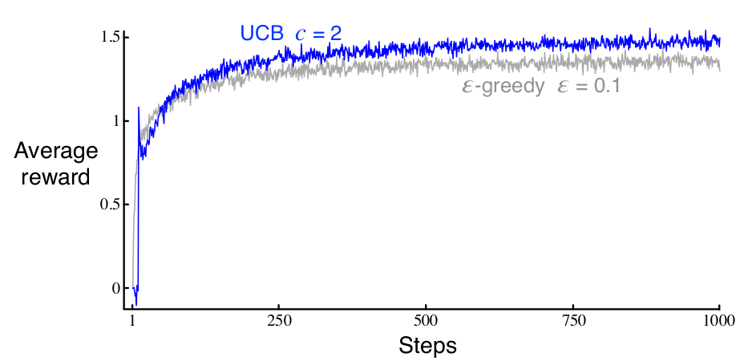

> Exploration is needed because there is always uncertainty about the accuracy of the action-value estimates. 

> The greedy actions are those that look best at present, but some of the other actions may actually be better. 
> *e-greedy* action selection forces the *non-greedy* actions to be tried, but indiscriminately, *with no preference for those that are nearly greedy or particularly uncertain*.

---
# Upper-Confidence-Bound Action Selection

It would be better to select among the non-greedy actions according to their potential for actually being optimal, taking into account both how close their estimates are to being maximal and the uncertainties in those estimates. 

$$ A_t=argmax_a\left[Q_t(a)+c\sqrt{\frac{\ln t}{N_t(a)}}\right] $$

* where $\ln t$ denotes the natural logarithm of $t$
* $N_t(a)$ denotes the number of times that action $a$ has been selected prior to time $t$ 
* The number $c > 0$ controls the degree of exploration. 
* If $N_t(a) = 0$, then $a$ is considered to be a maximizing action.
---
# The idea of UCB

The idea of this upper confidence bound (UCB) action selection is that the square-root term is a measure of the uncertainty or variance in the estimate of a’s value. 

The quantity being max’ed over is thus a sort of upper bound on the possible true value of action a, with c determining the confidence level. Each time a is selected the uncertainty is presumably reduced: Nt (a) increments, and, as it appears in the denominator, the uncertainty term decreases. 

On the other hand, each time an action other than a is selected, t increases but Nt (a) does not; because t appears in the numerator, the uncertainty estimate increases.

The use of the natural logarithm means that the increases get smaller over time, but are unbounded; all actions will eventually be selected, but actions with lower value estimates, or that have already been selected frequently, will be selected with decreasing frequency over time.

---
# Results with UCB on the 10-armed testbed are shown in Figure
UCB often performs well, as shown here

> But is more difficult than e-greedy to extend beyond bandits to the more general reinforcement learning settings

---