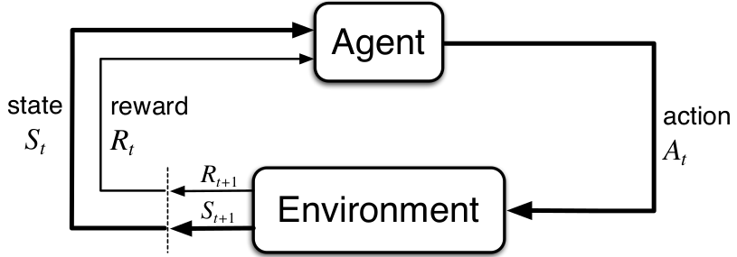
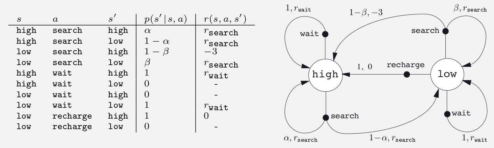

# Markov Decision Process (MDP)
#### or Finite Markov Decision Process
This problem involves evaluative feedback, as in bandits, but also an associative aspect—choosing different actions in different situations. 

MDPs are a classical formalization of sequential decision making, where actions influence not just immediate rewards, but also subsequent situations, or states, and through those future rewards.

Thus MDPs involve delayed reward and the need to tradeoff immediate and delayed reward.

> In bandit problems we estimated the value $q_*(a)$ of each action $a$, in MDPs we estimate the value $q_*(s, a)$ of each action $a$ in each state $s$, or we estimate the value $v_*(s)$ of each state given optimal action selections. 

##### These state-dependent quantities are essential to accurately assigning credit for long-term consequences to individual action selections.

---
# Agent–Environment Interface

MDPs are meant to be a straightforward framing of the problem of learning from interaction to achieve a goal. 

* The learner and decision maker is called the _agent_. 
- The thing it interacts with, comprising everything outside the agent, is called the *environment*. 
- These interact continually, the agent selecting *actions* and the environment responding to these actions and presenting new *situations* to the agent.

> The environment also gives rise to rewards, special numerical values that the agent seeks to maximize over time through its choice of actions.

---
### The agent–environment interaction in a Markov decision process


The agent and environment interact at each of a sequence of discrete time steps, $t = 0, 1, 2, 3, \ldots$ At each time step $t$, the agent receives some representation of the environment’s state, $S_t\in\mathbf{S}$, and on that basis selects an action, $A_t \in \mathbb{A}(s)$. 

**Onetime step later, in part as a consequence of its action**, the agent receives a numerical reward, $R_{t+1}\in \mathbf{R} \subset \mathbb{R,}$ and finds itself in a new state, $S_{t+1}$. 

> The MDP and agent together thereby give rise to a sequence or trajectory that begins like this:
> S0 , A0 , R1 , S1 , A1 , R2 , S2 ,A2 , R3 , . . .

or 

```
S0 , A0 , R1; 
S1 , A1 , R2;
S2 , A2 , R3;
, . . .
```

---

In a finite MDP, the sets of states, actions, and rewards $\mathbb{S}$, $\mathbb{A}$, and $\mathbb{R}$ all have a finite number of elements.
* The random variables $R_t$ and $S_t$ have well defined discrete probability distributions dependent only on the preceding state and action.
* For particular values of these random variables, $s'\in \mathbb{S}$ and $r'\in \mathbb{R}$, 
There is a probabilityof those values occurring at time t, given particular values of the preceding state and action

$$ p(s',r | s,a)= Pr\{S_t=s',\ R_t=r\ |\ S_{t-1}=s,\ A_{t-1}=a\}$$

here for all $s', s\in \mathbb{S}, r \in \mathbb{R}$ and $a\in\mathbb{A}(s)$. 


---
The dynamics function $p : \mathbb{S}\times \mathbb{R}\times  \mathbb{S}\times \mathbb{A}\rightarrow\left[0, 1\right]$ is an ordinary deterministic function of four arguments. 
* The $`|'$ in the middle of it comes from the notation for conditional probability, 

$$\sum_{s'\in \mathbf{S}}\sum_{r\in \mathbf{R}}p(s', r \ s, a) =1 \text{ for all } s\in\mathbf(S),a\in\mathbf{A}$$

--- 

# Markov Property

The probabilities given by $p$ completely characterize the environment’s dynamics. 

That is, the probability of each possible value for $S_t$ and $R_t$ depends only on the immediately preceding state and action, $S_{t-1}$ and $A_{t-1}$ , and, given them, not at all on earlier states and actions. 

The state must include information about all aspects of the past agent–environment interaction that make a difference for the future. 

If it does, then the state is said to have the *Markov property*.

---
From the four-argument dynamics function, $p$
$$ p(s',r | s,a)= Pr\{S_t=s',\ R_t=r\ |\ S_{t-1}=s,\ A_{t-1}=a\}$$
we can compute aboute env. or expected rewards as


$$ p(s'| s,a)= Pr\{S_t=s'|\ S_{t-1}=s,\ A_{t-1}=a\} = \sum_{r\in\mathbf{R}}p(s',r|s,a)$$


---
A Mobile Robot Example


