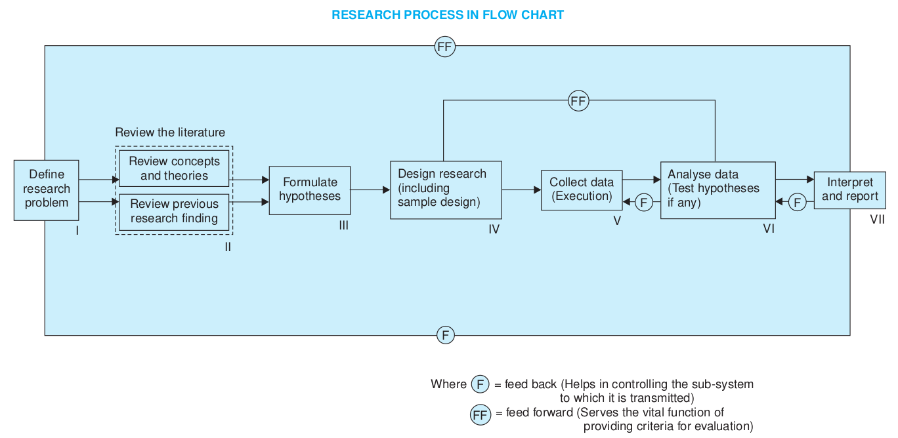
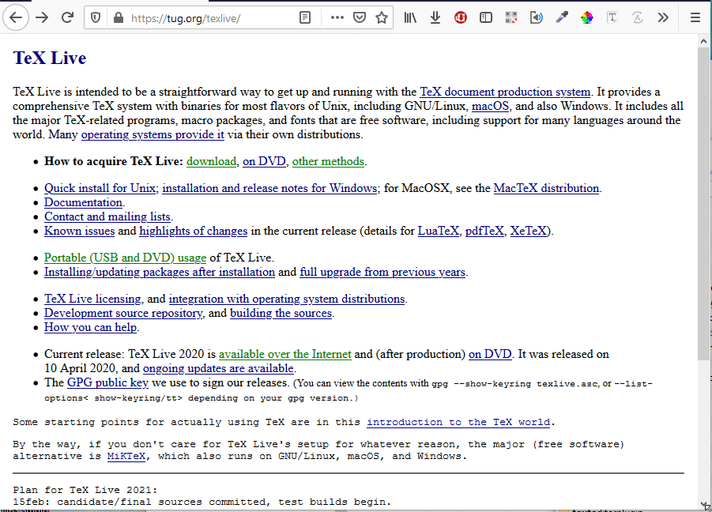
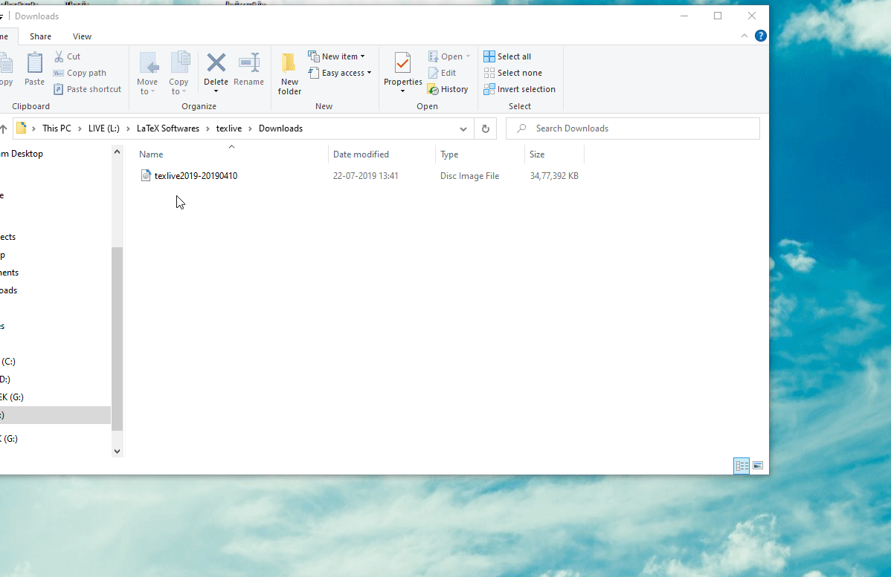
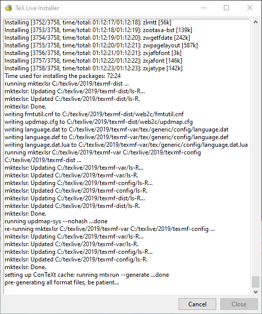

---

# Empirical research

> It is derived from the greek word **empeirikos** which means “experienced”

Empirical research is defined as any research where conclusions of the study is strictly drawn from concretely empirical **evidence**, and therefore are **“verifiable”** evidence.

> "I will not believe it unless I see it"

> *This came from the ancient empiricists, a fundamental understanding that powered the emergence of medieval science during the renaissance period and laid the foundation of modern science, as we know it today.*

---

# Deductive vs Inductive research

> Deductive 

* Develope a hypothesis based on existing theory, and then designing a research strategy to test the hypothesis
* Deductive approach is concerned with deducting conclusions from premises or propositions.

> Inductive

* Inductive approach starts with the observations and theories are proposed towards the end of the research process as a result of observations
* It involves the search for pattern from observation and the development of explanations, theories for those patterns through series of hypotheses.

> *No theories or hypotheses would apply in inductive studies at the beginning of the research and the researcher is free in terms of altering the direction for the study after the research process had commenced.*

---

# Criteria of Good Research

1. The **purpose** of the research should be **clearly defined**.

2. The **research procedure used should be described in sufficient detail to permit another researcher to repeat** the research for further advancement

3. The procedural design of the research should be carefully planned to yield results that are
   as objective as possible.

4. The researcher should **report their short commings**, like flaws in their design, human error, etc.

5. The validity and reliability of the data
   should be checked carefully.

6. Conclusions should be confined to those **justified by the data**.

### ***Good research is systematic, logical, empirical, and replicable.***

---

# Problems Encountered by Researchers in India

1. The lack of a scientific training in the methodology of research

2. Insufficient interaction between the university, business, government.

3. Business do not trust researchers with their data.

4. No assistance for clerical work.

5. Library mismanagement and lack of access to journals and books.

---

# Flow chart of Research process

[](./L05_ResearchProcess.png)

---

# LaTeX installation

---

### Download LaTeX (Texlive.iso and texworks)

Same iso file is used to install on windows, mac, or linux systems homepage: https://tug.org/texlive/

It can be downloaded from [https://ctan.org/tex-archive/systems/texlive/Images?lang=en](https://ctan.org/tex-archive/systems/texlive/Images?lang=en)

[](./L05_DownloadTexlive.gif)

---

Altough texworks is included in texlive, you may wanna install latest version from https://github.com/TeXworks/texworks/releases

### Mount downloaded texlive.iso to virtual drive

On Linux, windows 8, or windows 10,  
Double click to mount downloaded texlive.iso image in to virtual drive.

For older versions of windows you might need virtual drive software like:

1. [wincdemu](https://wincdemu.sysprogs.org/)
2. [winarchiver](http://www.winarchiver.com/) these softwares are optional but it saves space. You may directly extract files from texlive.iso using [winrar](http://www.rarlab.com/) or [7-zip](http://7-zip.org/). And install from extracted files.

***

---

### Installation

#### On Windows

double click on install-tl-windows.bat and installation will start from command window. Follow the installer instructions. The script will complete installation in around 20min to 60min

#### On Linux

double click on install-tl or right click on install-tl and select open in terminal. Follow.

---

[](./L05_MountAndInstall.gif)

The script will complete installation in around 20min to 60min
after installation of all packages

---

[](./L05_1.png)
[](./L05_2.png)

On completion click close.

Now you are ready to use LaTeX. Find Texworks in installed program and run it.

---

# Optional method

### Direct from internet on linux

-----------------------------

```bash
sudo apt-get install texlive texworks
```

Alternatively, windows users may also try
----------------------------------------

https://miktex.org/  
https://www.tug.org/protext/

***

---

# Reference

* [Research Methodolog by C R Kothari](https://www.academia.edu/43821533/Research Methodolog)


[https://t.me/+CgEoOwoKmpgwMzBl](https://t.me/+CgEoOwoKmpgwMzBl)

