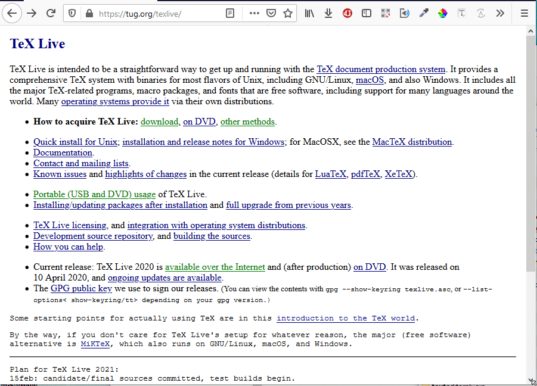
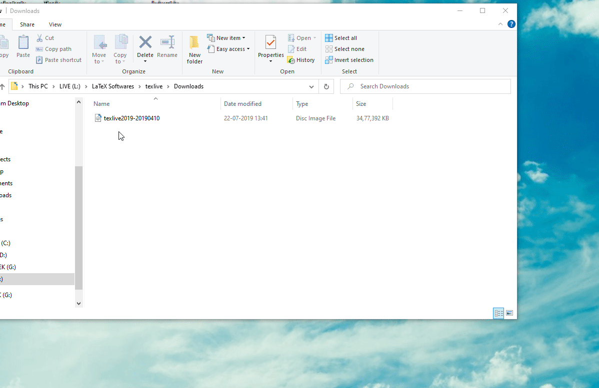
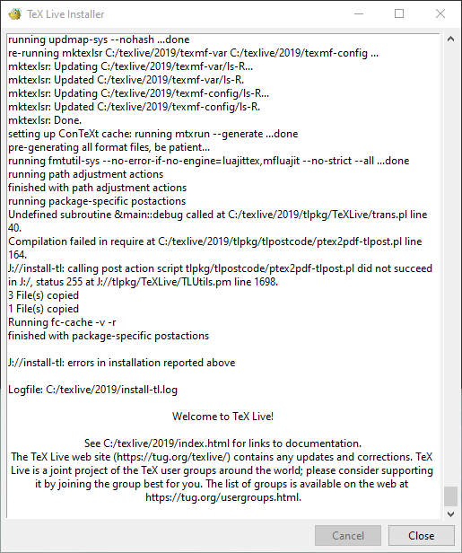

---

---

# LaTeX installation

---

### Download LaTeX (Texlive.iso and texworks)

Same iso file is used to install on windows, mac, or linux systems homepage: https://tug.org/texlive/

It can be downloaded from [https://ctan.org/tex-archive/systems/texlive/Images?lang=en](https://ctan.org/tex-archive/systems/texlive/Images?lang=en)

[](./L06/DownloadTexlive.gif)


---
Altough texworks is included in texlive, you may wanna install latest version from https://github.com/TeXworks/texworks/releases


### Mount downloaded texlive.iso to virtual drive

On Linux, windows 8, or windows 10,  
Double click to mount downloaded texlive.iso image in to virtual drive.

For older versions of windows you might need virtual drive software like:

1.  [wincdemu](https://wincdemu.sysprogs.org/)
2.  [winarchiver](http://www.winarchiver.com/) these softwares are optional but it saves space. You may directly extract files from texlive.iso using [winrar](http://www.rarlab.com/) or [7-zip](http://7-zip.org/). And install from extracted files.

***
---


### Installation

#### On Windows 

double click on install-tl-windows.bat and installation will start from command window. Follow the installer instructions. The script will complete installation in around 20min to 60min

#### On Linux 

double click on install-tl or right click on install-tl and select open in terminal. Follow.


---


[](./L06/MountAndInstall.gif)


The script will complete installation in around 20min to 60min
after installation of all packages

---
[](./L06/1.png)
[](./L06/2.png)

On completion click close.

Now you are ready to use LaTeX. Find Texworks in installed program and run it.


---


# Optional method
### Direct from internet on linux
-----------------------------

```bash 
sudo apt-get install texlive texworks
```
    

Alternatively, windows users may also try
----------------------------------------

https://miktex.org/  
https://www.tug.org/protext/

## online compiler with limitations
[latex.js.org](https://latex.js.org/playground.html)
[Overleaf](https://www.overleaf.com/)


---
# Introduction to LaTeX

### Introduction to texworks editor and hands on 

### File types basic intro. .tex .aux .log .pdf.
### Skelton File

### Sectioning

### Label and Reference

### Math symbols and equation.


---
# Skelton File

Lesson1.tex

```tex
\documentclass{article}
%PREAMBLE

\begin{document}
%MAIN CONTENT

Hello LaTeX
Hi \LaTeX

\end{document}
```
### Other classes
`\documentclass{letter}`,
`\documentclass{report}`,
`\documentclass{book}`,
`\documentclass{elsarticle}`,
`\documentclass{IEEEtran}`

---


# Sectioning of document
```tex
\part %work in book and report
\chapter %work in book and report
\section{}
\subsection{}
\subsubsection{}
\paragraph{}
```

```tex
\\
\newline
\par
\noindent
```

```tex
\label{} and \ref{}
```


---

# Equation and math symbols


```tex
$EQUATION$

$$EQUATION$$

\begin{equation}
EQUATION
\end{equation}
```


```tex
\alpha\beta\delta\Delta\int\sqrt\vec\overrightarrow\hat\frac ..
```


---
# CLASS DEMO

```latex

\documentclass{book}
%PREAMBLE

\usepackage{fullpage}%geometry


\usepackage{blindtext}


\begin{document}

\textbf{\blindtext}
\textit{\blindtext}
$E=mc^2$ $\eta$ $\int$ ${\sqrt\delta\Delta}$
$$\frac{num}{den}$$


\begin{equation}
F=ma
\label{eq:force}
\end{equation}


\begin{equation}
\overrightarrow{F}=m\vec{a}
\label{eq:force}
\end{equation}


\begin{equation}
F=ma\hat{a}
\label{eq:force}
\end{equation}
\blindtext equation \ref{eq:force}
%MAIN SECTION or DOCUMENT CONTENT

\chapter{some new chapter}
\part{A}
\chapter{main chapter}

\label{fig:name}
{tab:name}


%first section
\section{Introduction}\label{sec:intro}
hello latex
hi \LaTeX
this is some random        
\subsection{subsection}     
\blindtext 
\subsubsection{subsection}    \blindtext  
\paragraph{paragraph heading} \blindtext
\subsection{subsection}        text 
\label{introTwo}
this is some random textadflksjdf;laksjdf
this is some random textasdfasdgasdgsdagasdgag asldgoijasdg


% second part


 \part{B}
\chapter{ 2 main chapter}
\section{Introduction}
hello latex

\ref{intro} Refering here\\

\ref{introTwo} refer intro two\\
hi \LaTeX
this is some random        
\subsection{subsection}     
\blindtext 
\subsubsection{subsection}    \blindtext  
\paragraph{paragraph heading} \blindtext
\subsection{subsection}        text 

this is some random textadflksjdf;laksjdf
this is some random textasdfasdgasdgsdagasdgag asldgoijasdg aldsfgokapdofgpadofitextasdfasdg
asdgsdagasdgag asldgoijasdg aldsfgokapdofgpadofitextasdfasdg
asdgsdagasdgag asldgoijasdg aldsfgokapdofgpadofi
\par PARAGRAPH his is some random text
this is some random text
this is some random text

\section{METHOD}
this is some random text
this is some random text
this is some random text

\section{RESULTS}
\par PARAGRAPH his is some random text
this is some random text
this is some random text
this is some random text
this is some random text
this is some random text
\par\noindent NOINDENT PARAGRAPH his is some random text
this is some random text
this is some random text.\\NEWLINE this is some random text
this is some random text
this is some random text
\par PARAGRAPH his is \newline NEWLINE some random text
this is some random text
this is some random text
this is some random text
this is some random text
this is some random text
this is some random text


\end{document}

```
---

# Reference

.image[

]

[https://t.me/+pyS3-Wq2NjowYTk1](https://t.me/+pyS3-Wq2NjowYTk1)

