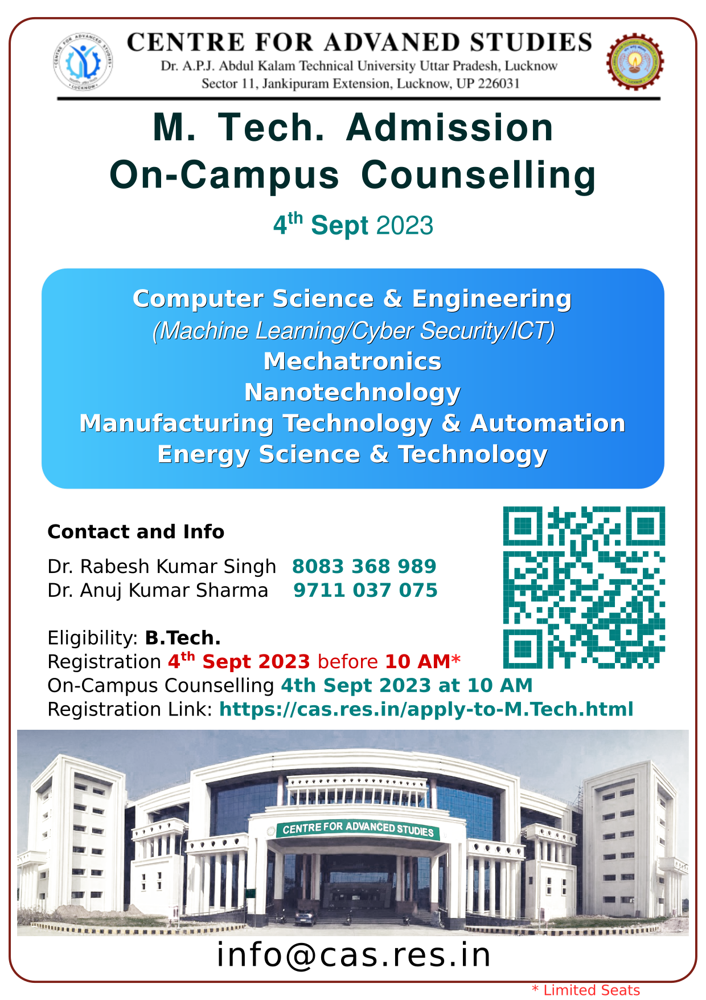

# Centre for Advanced Studies AKTU Lucknow
## M. Tech Admission 2023-24

[Registation Link](https://erp.aktu.ac.in/Webpages/Public/EntranceExams/CASPGGATE/Instructions.aspx) Last date 22 Aug 2023. [Details](https://cas.res.in/Apply-to-M.Tech.html)

 share

- GATE/UPCET PG 2023 qualified and 
- Non-GATE/Non-CUET PG 2023 qualified candidates 
- Who have registered and paid the counselling fee till 10AM, 22nd August 2023 can participate in this round of counselling 
- On 22 & 23 August 2023 respectively.

- GATE qualified candidates with valid score are eligible for admission at Centre for Advanced Studies with a monthly stipend as per AICTE/MHRD/University rules.
- Non-GATE qualified candidates are also eligible for admission at Centre for Advanced Studies based on the merit of CUET Exam-2023/Institute Level Exam.
- GATE and Non-GATE qualified candidates with domicile outside UP are also eligible for admission at Centre for Advanced Studies under the All India Open category.
- Admitted GATE qualified candidates will be eligible for a monthly stipend equivalent to the stipend as per AICTE/MHRD/University rules.
- All M Tech programs are AICTE approved

## Checklist for document verification

Bring following documents in orignal with one photocopy to attend counselling. 

1. B.E./ B.Tech, M.Sc. or qualifying examination final semester/Year mark sheet as per the
eligibility requirements specified in the information provided on CAS website at
https://cas.res.in/apply-to-M.Tech.html
1. 10+2 passing certificate/mark sheet
1. 10th certificate for date of birth
1. Respective discipline valid GATE score card and admit card
1. For admission under GATE qualified category, candidate must have qualified in his/her
respective category (Gen/ OBC/SC etc.) with a valid score card.
1. UP domicile certificate (For candidates who have passed their qualifying exam other than
U.P.)
1. Valid SC/ST/OBC category certificates (The OBC certificate must be issued on or after
1st April 2023)
1. Valid EWS certificate for EWS category seats (The EWS certificate must be valid in
current financial year, i.e. 2023-24)
1. Rs. 50000/- Demand Draft in Favor of “Finance Officer AKTU Lucknow” payable at
Lucknow
1. Two passport size photographs
1. Valid Government photo id proof (Aadhar, PAN, Driving License etc.)

### [Counselling guidelines](https://cas.res.in/pdf/Guidelines_counselling2023.pdf)
### [Fee details](https://cas.res.in/feedetails.html)
