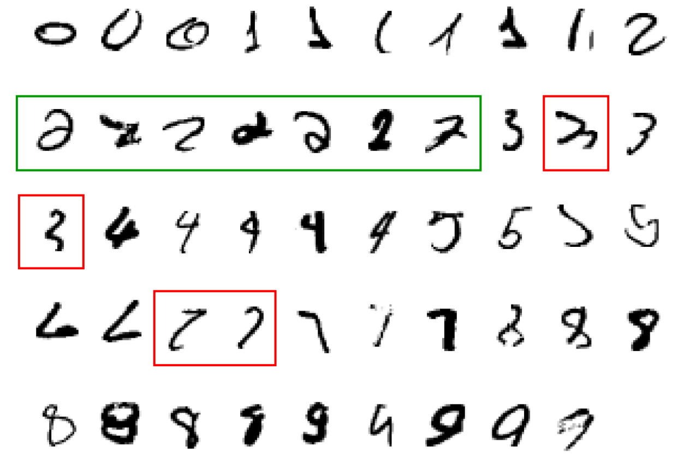
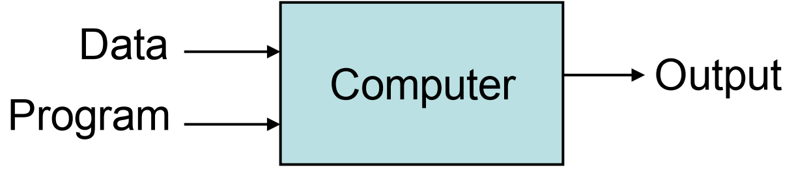
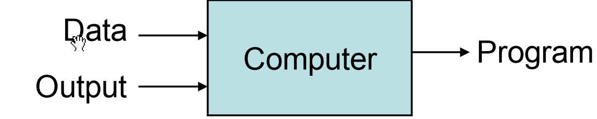
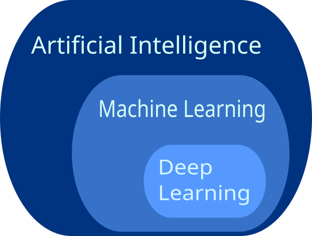
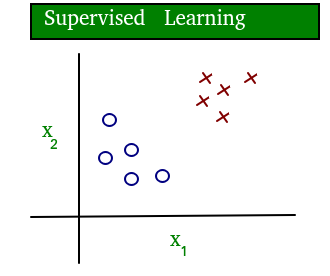
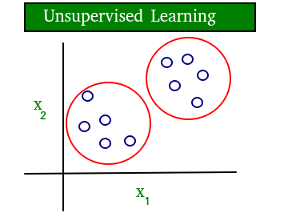
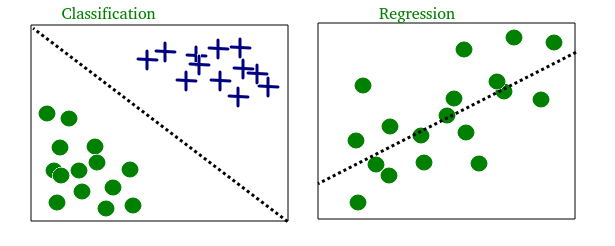
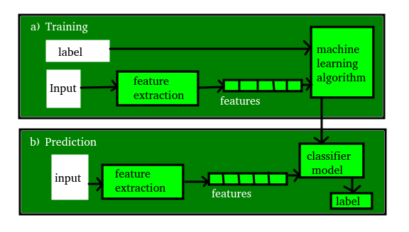

<style>
img{
    filter:hue-rotate(-40deg);
}
</style>

<div><h1>Welcome to two days workshop on Artificial Intelligence and Machine learning<h1></div>

Dr. Prateek Raj Gautam

---
# A few quotes, before we start.


#### "A breakthrough in machine learning would be worth ten Microsofts"
> (Bill Gates, Chairman, Microsoft)

#### “Machine learning is the next Internet"
> (Tony Tether, Director, DARPA)

#### "Machine learning is the hot new thing"
> (John Hennessy, President, Stanford)

#### "Web rankings today are mostly a matter of machine learning"
> (Prabhakar Raghavan, Dir. Research, Yahoo)

---
# Motivation for Machine Learning

### It is hard to write programs for certain tasks

* Human face or handwriting recognition
* Playing complex games like chess
* Recommending movies that a person will like
  
### Why?

* We do not ourselves know how to solve
* Algorithm will be too complicated
* Too many instances of the program needed (e.g., one for every user)

---
# Motivation for Machine Learning

### A classic example of a task that requires machine learning: It is very hard to say what makes a 2



---
# Motivation for Machine Learning

* Instead of writing a program by hand, collect lots of examples that specify the correct output for a given input.

 
* A machine learning algorithm takes these examples and produces a program that does the job.
  
* If done right, the program works for new cases as well as the ones we trained it on.

---
## Traditional Programming



## Machine Learning



---
# Human learning vs. ML

### Humans prefer to learn how to design the algorithm / program
> But for some very complex tasks, humans also learn from example inputs and outputs
Some aspects common to both

**Desired:** Generalization to new or unknown
* E.g., teach a child to look out for vehicles while crossing a road

**Challenge:** Learning a wrong model due to specific training examples used
* E.g., teach a child to distinguish between ”safe” (cow,cat) and “dangerous” animals (lion, tiger)
---
Before we continue 

# What is AI ML and DL



---

# Artificial Intelligence

### Artificial Intelligence is basically the mechanism to incorporate human intelligence into machines through a set of rules (algorithm).

AI is a combination of two words: **“Artificial"** meaning something made by humans or non-natural things and **“Intelligence"** meaning the ability to understand or think accordingly.

> Another definition could be that “AI is basically the study of training your machine(computers) to mimic a human brain and it’s thinking capabilities".

*AI focuses on 3 major aspects(skills): * **learning, reasoning and self-correction** * to obtain maximum efficiency possible.*

---

# Machine Learning

Machine Learning is basically the study/process which provides the system(computer) to **learn automatically** on its own **through experiences** it had and improve accordingly **without being explicitly programmed**.

> ML is an application or subset of AI.

ML focuses on the development of programs so that it can access data to use it for themselves. The entire process makes observations on data to identify the possible patterns being formed and make better future decisions as per the examples provided to them.

> The major aim of ML is to allow the systems to learn by themselves through the experience without any kind of human intervention or assistance.


---

# Deep Learning

Deep Learning is basically a sub-part of the broader family of Machine Learning which makes use of Neural Networks(similar to the neurons working in our brain) to mimic human brain-like behavior.

> DL algorithms focus on information processing patterns mechanism to possibly **identify the patterns just like our human brain** does and classifies the information accordingly.

DL works on larger sets of data when compared to ML and **prediction mechanism is self-administered by machines**.


---
# Machine Learning definition

### Arthur Samuel (1959):
Field of study that gives computers the ability to learn without being explicitly programmed.
### Tom Mitchell (1998):
Well-posed Learning Problem: A computer program is said to learn from **experience E** with respect to some **task T** and some **performance measure P**, if its performance on T, as measured by P, improves with experience E.

---
# What is Learning

Any agent is said to **learn** from **experience E** with respect to some class of **tasks T**, and a **performance measure P**, if the learner's **performance** at **task** in the class, as measured by *P*, improves with **experience**.

## TASK

## EXPERIENCE

## PERFORMANCE


---

# What is ML?

> It is basically a process of **training** a piece of software called an algorithm or **model**, to make useful **predictions** from data.

---
## Some more examples of tasks that are best solved by using a learning algorithm
#### Recognizing patterns

* Facial identities or facial expressions
* Handwritten or spoken words
* Medical images

#### Generating patterns

* Generating images or motion sequences

#### Recognizing anomalies

* Unusual sequences of credit card transactions
* Unusual patterns of sensor readings in a nuclear power plant or unusual sound in your car engine.

#### Prediction

* Future stock prices or currency exchange rate


---

# Types of machine learning problems

On basis of the nature of the learning **“signal"** or **“feedback"** available to a learning system

## Supervised Learning

## Unsupervised Learning

## Semi-supervised Learning

## Reinforcement Learning

---

# Supervised learning

The model or algorithm is presented with example inputs and their desired outputs and then finding patterns and connections between the input and the output.

> The goal is to learn a general rule that maps inputs to outputs.

The training process continues until the model achieves the desired level of accuracy on the training data.

---

# Supervised learning

Some real-life examples are:

#### Image Classification:

You train with images/labels. Then in the future you give a new image expecting that the computer will recognize the new object.

#### Market Prediction/Regression:

You train the computer with historical market data and ask the computer to predict the new price in the future.

---

# Unsupervised learning

No labels are given to the learning algorithm, leaving it on its own to find structure in its input.

It is used for clustering population in different groups.

Unsupervised learning can be a goal in itself (discovering hidden patterns in data).

#### Clustering:

You ask the computer to separate similar data into clusters, this is essential in research and science.

#### High Dimension Visualization:

Use the computer to help us visualize high dimension data.

### Generative Models:

After a model captures the probability distribution of your input data, it will be able to generate more data. This can be very useful to make your classifier more robust.

---

# Example

A simple diagram which clears the concept of supervised and unsupervised learning is shown below:

 

the data in supervised learning is labelled, where as data in unsupervised learning is unlabelled.

---

## Semi-supervised learning:

Problems where you have a large amount of input data and only some of the data is labeled, are called semi-supervised learning problems.

These problems sit in between both supervised and unsupervised learning.

> a photo archive where only some of the images are labeled, (e.g. dog, cat, person) and the majority are unlabeled.

---

## Reinforcement learning:

A computer program interacts with a dynamic environment in which it must perform a certain goal (such as driving a vehicle or playing a game against an opponent). 

> The program is provided **feedback** in terms of **rewards** and **punishments** as it navigates its problem space.


---

# Supervised learning:

Two most common use cases of supervised learning:

## Classification

## Regression

---

# Classification:

Inputs are divided into two or more classes, and the learner must produce a model that assigns unseen inputs to one or more (multi-label classification) of these classes and predicting whether or not something belongs to a particular class.

This is typically tackled in a supervised way.

Classification models can be categorized in two groups:

> Binary classification and Multiclass Classification.

*Spam filtering is an example of binary classification, where the inputs are email (or other) messages and the classes are “spam" and “not spam".*

---

# Regression:

It is also a **supervised** learning problem, that predicts a numeric value and outputs are continuous rather than discrete.

For example, predicting the stock prices using historical data.

Classification and regression on two different datasets :



---

# Most common Unsupervised learning are:

### Clustering:

Here, a set of inputs is to be divided into groups. Unlike in classification, the groups are not known beforehand, making this typically an unsupervised task.

### Density estimation:

The task is to find the distribution of inputs in some space.

### Dimensionality reduction:

It simplifies inputs by mapping them into a lower-dimensional space. *Topic modeling is a related problem, where a program is given a list of human language documents and is tasked to find out which documents cover similar topics.*

---

# Some commonly used machine learning algorithms are

1. Linear Regression,
2. Logistic Regression,
3. Decision Tree,
4. SVM(Support vector machines),
5. Naive Bayes,
6. KNN(K nearest neighbors),
7. K-Means,
8. Random Forest, etc.

---
# Iris dataset

| Sepal Length | Sepal Width | Petal Length | Petal Width |    Species    |
|     5.1      |     3.5     |     1.4      |     0.2     |     Setosa    |
|     4.9      |     3.0     |     1.4      |     0.2     |     Setosa    |
|     7.0      |     3.2     |     4.7      |     1.4     |  Versicolor   |
|     6.4      |     3.2     |     4.5      |     1.5     |  Versicolor   |
|     6.3      |     3.3     |     6.0      |     2.5     |   Virginica   |
|     5.8      |     2.7     |     5.1      |     1.9     |   Virginica   |


###### Features: 
Sepal Length, Sepal Width, Petal Length, Petal Width
###### Target: 
Species (Setosa, Versicolor, Virginica)

The Iris dataset consists of measurements of sepal length, sepal width, petal length, and petal width for three different species of Iris flowers: Setosa, Versicolor, and Virginica.

---

# Terminologies of Machine Learning

### 1 Model

A model is a **specific representation** learned from data by applying some machine learning algorithm.

A model is also called **hypothesis**.

---

# Terminologies of Machine Learning

### 2 Feature

A feature is an individual measurable property of our data.
A set of numeric features can be conveniently described by a **feature vector**.
Feature vectors are fed as input to the model.
*For example, in order to predict a fruit, there may be features like color, smell, taste,... *
> **Note:** Choosing informative, discriminating and independent features is a crucial step for effective algorithms. We generally employ a **feature extractor** to extract the relevant features from the raw data.

---

# Terminologies of Machine Learning

### 3 Target (Label)

A target variable or label is the value to be predicted by our model.

For the fruit example discussed in the features section, the label with each set of input would be the name of the fruit like apple, orange, banana, etc.

---

# Terminologies of Machine Learning

### 4 Training

The idea is to give a set of inputs(features) and it’s expected outputs(labels), so after training, we will have a model (hypothesis) that will then map new data to one of the categories trained on.

---

# Terminologies of Machine Learning

### 5 Prediction

Once our model is ready, it can be fed a set of inputs to which it will provide a predicted output(label).

> But make sure if the machine performs well on unseen data, then only we can say the machine performs well.

---

# ML Training and Prediction



---
# Confusion Matrix

Suppose we have a dataset of 100 patients, and our task is to classify whether they have a certain disease (positive class) or not (negative class) based on some symptoms. We build a model that makes predictions on this dataset.

1. True Positive (TP):
A true positive (TP) occurs when the model correctly predicts a positive instance. 
> In our example, let's say the model correctly identifies 20 patients as having the disease. These 20 patients actually have the disease, so they are true positives. 

2. True Negative (TN):
A true negative (TN) occurs when the model correctly predicts a negative instance. 
> In our example, let's say the model correctly identifies 70 patients as not having the disease. These 70 patients are actually disease-free, so they are true negatives.

#### To summarize:

* True Positive (TP): The model predicts positive, and it is correct.
* True Negative (TN): The model predicts negative, and it is correct.

It's important to note that TP and TN are both correct predictions made by the model. They indicate instances where the model's predictions align with the actual ground truth labels.


---
# Confusion Matrix
Suppose we have a dataset of 100 images, where 60 images are cats and 40 images are dogs. We build a model to classify these images as either "cat" or "dog."

After applying the model to the dataset, here's what the confusion matrix might look like:

```
                    Predicted
                  | Cat  | Dog  |
------------------|------|------|
Actual    Cat     | 30   | 5    |
          Dog     | 10   | 55   |
```

Now, let's break down each component of the confusion matrix:

1. **True Positives (TP)**: The model predicted "cat," and it was correct. In this example, the model correctly classified 30 images as cats (TP).

2. **True Negatives (TN)**: The model predicted "dog," and it was correct. In this example, the model correctly classified 55 images as dogs (TN).

3. **False Positives (FP)**: The model predicted "cat," but it was incorrect. In this example, the model wrongly classified 10 dog images as cats (FP).

4. **False Negatives (FN)**: The model predicted "dog," but it was incorrect. In this example, the model wrongly classified 5 cat images as dogs (FN).

The confusion matrix allows us to visualize the performance of the classification model in terms of these four categories. It provides insights into the model's ability to correctly identify positive and negative instances. 

> By analyzing the confusion matrix, we can calculate various evaluation metrics such as accuracy, precision, recall, and F1-score, which help assess the overall performance of the model.
---
# Thanks for your kind attention

In the next three sessions you will be introduced with [Python](https://www.python.org/downloads/), installation of [JupyterLab](https://jupyter.org/), importing necessary modules and dataset, few ML techniques like KNN, Naive Bayes.

You can read more about various research activities from [institute website](https://cas.res.in/research1.html)

# Reference

[Machine Learning in Action by Peter Harrington]()
